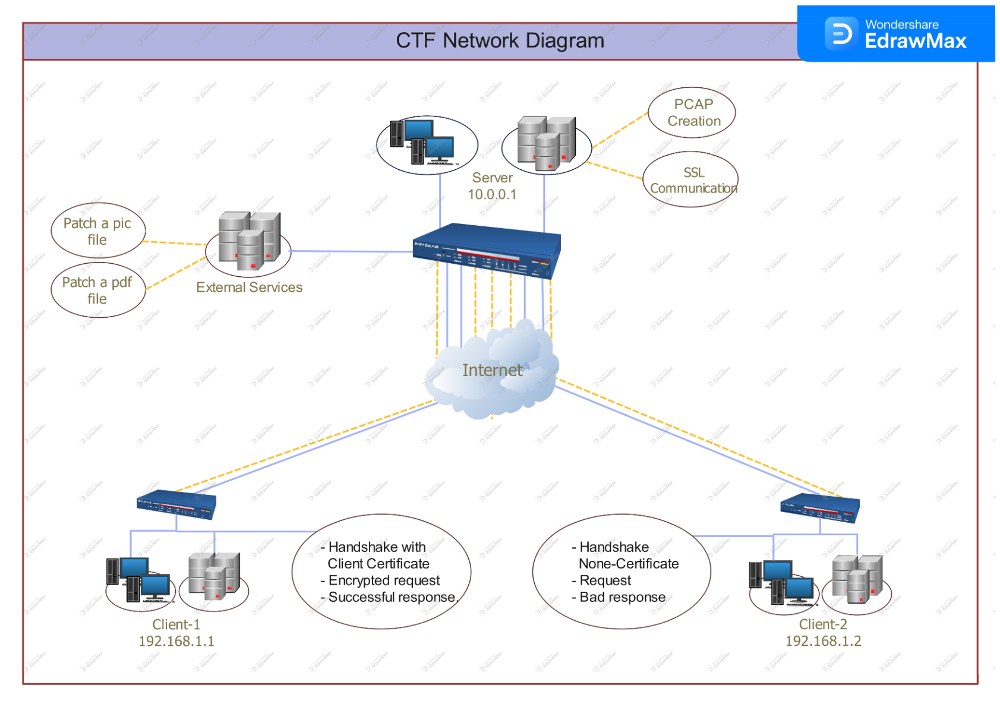
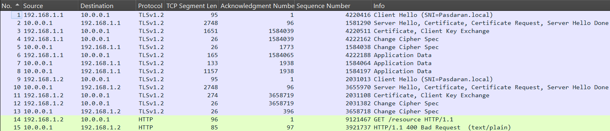
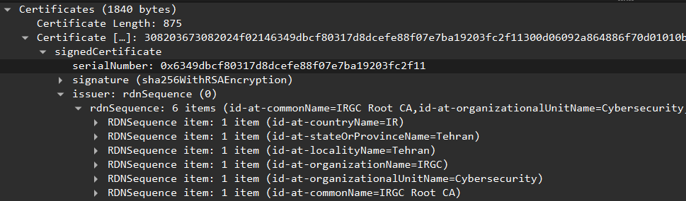

# CTF Challenge: TLS Handshake and Encryption Algorithms

## Project Overview

This project is a Capture The Flag (CTF) challenge focused on network security and the TLS protocol. The challenge is designed to test participants' understanding of TLS handshake processes, certificate management, and encrypted communication analysis.

### Project Components

1. **PCAP Creation for Participants:**
   - The PCAP file simulates communication between a server and two clients. Both clients perform a handshake with the server. The server requests a CLIENT CERT, but only Client 1 provides it, while Client 2 does not.
   - Encrypted application data communication occurs between Client 1 and the server, consisting of three packets (HTTP GET, 200 OK, resource sent).

2. **Two Communication Sessions:**
   - **Session 1: Server and Client Communication:**
     - The server is an Iranian server, and participants need to understand from the PCAP that the server expects the client to send a client certificate signed by a specific CA.
     - Participants then move to the next communication session.

   - **Session 2: Client and CA Server Communication:**
     - The client requests the CA server to sign a CSR.
     - The CA server signs the CSR and sends back a signed certificate.
     - Participants return to the first communication session and attempt to send the signed CLIENT CERT to the Iranian server but find that the server does not respond positively.
     - The server requires a specific condition to be present in the certificate.
     - Participants realize they need to edit the CSR before sending it to the CA.
     - By performing a MITM attack using Burp Suite, participants edit the CSR as required and get it signed by the CA.
     - Participants return to the first communication session and send the appropriate CRT to the Iranian server.
     - The server responds positively and sends encrypted messages to the client.
     - Participants need to determine the encryption cipher used.

3. **Decrypting the Encrypted Messages:**
   - The server downloads an image to the participant's computer, showing an Enigma machine and a hidden hint in the binary code of the image (hex view) that contains the Enigma machine configuration, except for the specific model.
   - Using the configuration and searching online for Enigma cipher decryption, participants can determine the machine model.
   - After decryption, participants understand the words "Client" and "Master Secret" and need to deduce that these are two strings forming the SSLKEYLOG file.
   - They load it into Wireshark, decrypt the application data, and find the flag.



```sh
pip install -r requirements.txt
```

## Table of Contents
- [Challenge Description](#challenge-description)
- [Subjects](#subjects)
- [Usage](#usage)
    - [PCAP Creation Overview](#pcap-creation-overview)
        - [TLS Handshake Steps](#tls-handshake-steps)
        - [Client Hello](#client-hello)
        - [Server Hello](#server-hello)
        - [Client Key Exchange](#client-key-exchange)
        - [Calculate Master Secret](#calculate-master-secret)
        - [Client Change Cipher Spec](#client-change-cipher-spec)
        - [Server Change Cipher Spec](#server-change-cipher-spec)
        - [Create SSLKeyLog File](#create-sslkeylog-file)
        - [Application Data Encryption](#application-data-encryption)
    - [SSL Communication Overview](#ssl-communication-overview)
        - [Project Description](#project-description)
- [Challenge Steps](#challenge-steps)
- [Participants Solution](#participants-solution)
- [External Tools](#external-tools)
- [Known Limitations](#known-limitations)
- [Contributing](#contributing)
- [License](#license)

## Challenge Description

The challenge is themed around the Ritchie Boys, a historical group of German-born individuals recruited by the US Army in World War II for intelligence and psychological warfare against Nazi Germany.
In the context of the challenge, the Ritchie Boys Force is revived in 2025 to combat Iran's Islamic Revolutionary Guard Corps.
The player's goal is to compromise an Iranian server and extract the encryption key used for the organization's radio communications.


## Subjects
This challenge develops a broad range of technical skills, including:

1. **Network Traffic Analysis**:
   - Using Wireshark to analyze captured network packets.
   
2. **Python Scripting**:
   - Creating PCAP files with Scapy.
   - Implementing socket programming for communication emulation.

3. **Operating System Forensics**:
   - Analyzing PE file formats.
   - Applying forensic techniques for hidden data extraction.

4. **Cryptography**:
   - Understanding encryption key generation and usage.
   - Decrypting files and securing communication.

5. **HTTP Protocol Analysis**:
   - Identifying and exploiting bugs in HTTP communications.

6. **Reverse Engineering**:
   - Extracting and embedding executable files within PDFs.

7. **PCAP File Creation**:
   - Simulating network interactions and capturing them for analysis with Scapy.

8. **Protocol Analysis Tools**:
   - Leveraging TShark for deeper protocol inspection.
   - Using OpenSSL for TLS/SSL operations in a WSL environment.

---

## Usage

### PCAP Creation Overview



The **UnifiedTLSSession** class facilitates the simulation of a TLS session between a client and a server, enabling the creation of PCAP files.

### Core Features

1. **TLS Handshake**: Simulates certificate exchange and encryption negotiation to establish a secure connection.
2. **Application Data Exchange**: Supports both encrypted `TLS` and unencrypted `HTTP` communication based on session configuration.

```python
import logging

def main() -> None:
    """Main function to run TLS sessions"""
    # Load configuration first
    config = NetworkConfig.load()

    # Setup logging using the log_path and log_level from config
    setup_logging(
        log_path=config.log_path,
        level=config.log_level
    )
    logging.info("Starting TLS session simulation")

    # Setup environment and continue with rest of the code
    writer = setup_environment(config)
    
    # Run Client 1 session (with certificate)
    run_client_session(
        writer=writer,
        client_ip=NetworkAddresses.CLIENT_1_IP,
        server_ip=NetworkAddresses.SERVER_IP,
        client_port=NetworkPorts.CLIENT_DEFAULT,
        use_client_cert=True,
        request=NetworkConfig.GET_REQUEST,
        response=NetworkConfig.OK_RESPONSE,
        challenge_file=CHALLENGE_FILE
    )
    
    # Run Client 2 session (without certificate)
    run_client_session(
        writer=writer,
        client_ip=NetworkAddresses.CLIENT_2_IP,
        server_ip=NetworkAddresses.SERVER_IP,
        client_port=NetworkPorts.CLIENT_DEFAULT + 1,
        use_client_cert=False,
        request=NetworkConfig.GET_REQUEST,
        response=NetworkConfig.BAD_REQUEST
    )
    
    # Save and verify results
    save_results(writer, config)
```

### **TLS Handshake Steps**
The TLS handshake establishes a secure connection between the client and server by exchanging cryptographic parameters.

```python
import logging

def perform_handshake(self) -> bool:
    """Executes the TLS handshake steps"""
    send_client_hello(self)
    send_server_hello(self)
    send_client_handshake_messages(self)
    handle_master_secret(self)
    
    # The ChangeCipherSpec notifies the server that subsequent messages will be encrypted
    send_client_change_cipher_spec(self)
    send_server_change_cipher_spec(self)
    handle_ssl_key_log(self)
    
    self.state.handshake_completed = True
    logging.info("TLS Handshake completed successfully")
    return True
```
## **TLS Handshake Process**
### **Client Hello**
**Purpose**: The client initiates the handshake by sending supported `ciphers`, `extensions`, and `random` bytes.

```python
from scapy.layers.tls.crypto.suites import TLS_RSA_WITH_AES_128_CBC_SHA256
from scapy.layers.tls.handshake import TLSClientHello
from tls.constants import TLSVersion
from typing import Optional

def create_client_hello(
    session,
    extensions: Optional[ClientExtensions] = None
) -> TLSClientHello:
    """Creates a TLS Client Hello message"""
    # Generate client random
    session.client_GMT_unix_time, session.client_random_bytes = generate_random()
    session.client_random = session.client_GMT_unix_time.to_bytes(4, 'big') + session.client_random_bytes
    logging.info(f"Generated client_random: {session.client_random.hex()}")

    # Use default extensions if none provided
    if not extensions:
        extensions = ClientExtensions(
            server_name=session.SNI,
            supported_groups=["x25519"],
            signature_algorithms=["sha256+rsa"]
        )

    return TLSClientHello(
        version=TLSVersion.TLS_1_2,
        ciphers=[TLS_RSA_WITH_AES_128_CBC_SHA256],
        ext=extensions.get_extension_list(),
        gmt_unix_time=session.client_GMT_unix_time,
        random_bytes=session.client_random_bytes
    )
```

**Explanation:**
1. **Client Random:** Combines the GMT Unix timestamp and 28 random bytes.
2. **Supported Ciphers:** Advertises the supported algorithms for encryption and hashing.
3. **Extensions:** Adds optional features like server name indication, supported groups, and signature algorithms.

---

### **Server Hello**
**Purpose**: Responds to the `Client Hello` by providing `random` bytes, the `selected cipher` (encryption parameters), and `extensions`.

```python
from scapy.layers.tls.crypto.suites import TLS_RSA_WITH_AES_128_CBC_SHA256
from scapy.layers.tls.handshake import TLSServerHello
from tls.constants import TLSVersion
from typing import Optional

def create_server_hello(
        session,
        extensions: Optional[ServerExtensions] = None
        ) -> TLSServerHello:

    # Generate server random
    session.server_GMT_unix_time, session.server_random_bytes = generate_random()
    session.server_random = session.server_GMT_unix_time.to_bytes(4, 'big') + session.server_random_bytes
    logging.info(f"Generated server_random: {session.server_random.hex()}")

    # Use default extensions if none provided
    if not extensions:
        extensions = ServerExtensions(
            signature_algorithms=['sha256+rsaepss']
        )

    return TLSServerHello(
        version=TLSVersion.TLS_1_2,
        gmt_unix_time=session.server_GMT_unix_time,
        random_bytes=session.server_random_bytes,
        sid=os.urandom(32),
        cipher=TLS_RSA_WITH_AES_128_CBC_SHA256.val,
        ext=extensions.get_extension_list()
    )
```

**Explanation:**
1. **Server Random:** Combines a timestamp and random bytes for key generation.
2. **Selected Cipher:** Agrees upon one cipher suite from the client’s list.
3. **Extensions:** Adds advanced security options like extended master secrets.

Server certificate signed by CA:


---

### **Client Key Exchange**
**Purpose**: The client generates a `Pre-Master Secret`, encrypts it, and sends it to the server.
This secret is encrypted using the server's `public key`, making it accessible only to the intended recipient.

```python
from scapy.layers.tls.handshake import TLSCertificate, TLSClientKeyExchange
from tls.utils.cert import load_cert

def create_client_certificate_and_key_exchange(
        session
        ) -> tuple[TLSCertificate, TLSClientKeyExchange]:

    # Prepare client certificate
    if session.use_client_cert:
        client_cert_path = CERTS_DIR / "client.crt"
        cert = load_cert(client_cert_path)
        cert_der = cert.public_bytes(serialization.Encoding.DER)
        client_certificate = TLSCertificate(certs=[(len(cert_der), cert_der)])
        logging.info("Prepared client certificate")
    else:
        client_certificate = TLSCertificate(certs=[])
        logging.info("Prepared empty certificate")

    # Generate and encrypt pre-master secret
    session.pre_master_secret = generate_pre_master_secret()
    session.encrypted_pre_master_secret = encrypt_pre_master_secret(
        session.pre_master_secret,
        session.server_public_key
    )

    if not isinstance(session.encrypted_pre_master_secret, bytes):
        session.encrypted_pre_master_secret = bytes(session.encrypted_pre_master_secret)
    
    logging.info(f"Encrypted pre_master_secret length: {len(session.encrypted_pre_master_secret)}")

    # Create key exchange message
    length_bytes = len(session.encrypted_pre_master_secret).to_bytes(2, 'big')
    client_key_exchange = TLSClientKeyExchange(
        exchkeys=length_bytes + session.encrypted_pre_master_secret
    )

    return client_certificate, client_key_exchange
```

**Explanation:**
1. **Client Certificate:** A TLS certificate representing the client is prepared and appended to the handshake messages.
2. **Pre-Master Secret:** A randomly generated `pre-master secret` is created for the session.
   This value serves as the foundation for deriving the `master secret` used in subsequent encryption.
3. **Encryption:** The `pre-master secret` is encrypted using the `server's public key`, ensuring secure transmission.
   The encryption guarantees that only the server, possessing the corresponding `private key`, can decrypt it.
4. **Key Exchange Message:** The encrypted `pre-master secret` is packaged into a key exchange message, preceded by its length in bytes.

***Notice:***
In **TLS 1.2**, when using **RSA Key Exchange**, no `ServerKeyExchange` message is sent.
The handshake process relies on encrypting the `Pre-Master Secret` with the server's public key, so no additional signature is required from the server.
However, in cases of **Diffie-Hellman (DH)** or **Elliptic Curve Diffie-Hellman (ECDH)**, a `ServerKeyExchange` message is necessary.

---

### **Master Secret Generation**
```python

def generate_master_secret(
        session,
        encrypted_pre_master_secret: bytes, 
        client_random: bytes,
        server_random: bytes
    ) -> bytes:

    # Decrypt pre-master secret
    pre_master_secret = decrypt_pre_master_secret(
        encrypted_pre_master_secret,
        session.server_private_key
    )
    
    # Compute master secret
    master_secret = session.prf.compute_master_secret(
        pre_master_secret, 
        client_random,
        server_random
    )
    return master_secret
```
**Explanation:**
1. **Decryption:** The server decrypts the `pre-master secret` using its private key.
2. **Master Secret Calculation:** Uses the PRF (Pseudo-Random Function) to derive the `master secret` from the `pre-master secret`, `client random`, and `server random` values.

### **Encryption Method:**
The `encrypt_pre_master_secret()` function:
- Uses **PKCS#1 v1.5 padding** (standard for RSA encryption).
- Encrypts the `pre-master secret` with the **server's public key**.
- Returns the encrypted bytes.

---

#### Calculate Master Secret
**Purpose:** The `master secret` is a crucial part of the TLS handshake, derived by both the client and server using the `pre-master secret` and `random` values exchanged during the handshake. It ensures the secure generation of session keys for encryption and integrity checks.

```python
def handle_master_secret(session) -> None:
    session.master_secret = generate_master_secret(
        session,
        session.encrypted_pre_master_secret,
        session.client_random,
        session.server_random
    )
```

**Explanation:**
1. **Client Side:**
   - The client encrypts the `pre_master_secret` using the server's public key from its certificate.
   - This ensures that only the server can decrypt it.

2. **Server Side:**
   - The server decrypts the `pre_master_secret` using its private key.
   - This step verifies that the client has a valid server certificate and ensures confidentiality.

3. **Both Sides:**
   - Using the same `pre_master_secret`, along with the `client_random` and `server_random`, both the client and server derive the same `master_secret`.
   - This `master_secret` is the foundation for symmetric encryption keys used in the session.

---

### Client Change Cipher Spec

**Purpose:** The `ChangeCipherSpec` message is sent by the client to notify the server that it will start using the negotiated encryption and MAC settings. This is immediately followed by the `Finished` message, encrypted with the newly established settings.

```python
def send_client_change_cipher_spec(session) -> bytes:
    # Create messages
    client_finished, change_cipher_spec = create_client_finished(session)

    # Send messages
    session.send_to_server(client_finished)
    session.send_to_server(change_cipher_spec)

    # Update handshake state
    session.handshake_messages.append(raw(client_finished))
    session.handshake_messages.append(raw(change_cipher_spec))
    session.tls_context.msg = [change_cipher_spec, client_finished]

    logging.info("Client ChangeCipherSpec and Finished messages sent")
    return session.send_tls_packet(
        session.client_ip,
        session.server_ip,
        session.client_port,
        session.server_port,
        is_handshake=True
    )
```

**Explanation:**

1. **Verify Data:**
   - The client computes the `verify_data` using all previous handshake messages and the derived `master_secret`.
   - This ensures the integrity of the handshake.

2. **ChangeCipherSpec Message:**
   - Signals the server that future messages will use the negotiated encryption and integrity settings.

3. **Finished Message:**
   - This is the first message encrypted with the new cipher settings, proving that both client and server share the same session keys.

---

### Server Change Cipher Spec

**Purpose:** The server sends the `ChangeCipherSpec` message to notify the client it will use the negotiated encryption settings. It follows with the `Finished` message, encrypted with the new settings, to confirm the handshake.

```python
def send_server_change_cipher_spec(session) -> bytes:
    # Create messages
    server_finished, change_cipher_spec = create_server_finished(session)

    # Send messages
    session.send_to_client(server_finished)
    session.send_to_client(change_cipher_spec)

    # Update handshake state
    session.handshake_messages.append(raw(server_finished))
    session.handshake_messages.append(raw(change_cipher_spec))
    session.tls_context.msg = [change_cipher_spec, server_finished]

    logging.info("Server ChangeCipherSpec and Finished messages sent")
    return session.send_tls_packet(
        session.server_ip,
        session.client_ip,
        session.server_port,
        session.client_port,
        is_handshake=True
    )
```

**Explanation:**

1. **Verify Data:**
   - The server computes `verify_data` using the handshake messages and `master_secret`.
   - Confirms the integrity and authenticity of the handshake.

2. **ChangeCipherSpec Message:**
   - Notifies the client that the server is switching to the negotiated encryption settings.

3. **Finished Message:**
   - Sent encrypted, verifying that the server is ready for secure communication.

---

### **Create SSLKeyLog File**

**Purpose:** Enables debugging of encrypted TLS traffic by exporting the `master_secret` and `client_random` to a log file, making it compatible with tools like Wireshark.

```python
def setup_environment(config: NetworkConfig) -> CustomPcapWriter:
    writer = CustomPcapWriter(config)
    
    # Clear SSL keylog file
    if hasattr(config, 'SSL_KEYLOG_FILE'):
        Path(LoggingPaths.SSL_KEYLOG).write_text('')
        logging.info(f"Cleared SSL keylog file: {LoggingPaths.SSL_KEYLOG}")
    
    return writer

def handle_ssl_key_log(session) -> None:
    # Make sure directory exists
    LoggingPaths.SSL_KEYLOG.parent.mkdir(parents=True, exist_ok=True)
    
    # Open in write mode to clear previous content
    with open(LoggingPaths.SSL_KEYLOG, "w") as f:
        client_random_hex = session.client_random.hex()
        master_secret_hex = session.master_secret.hex()
        # Format: CLIENT_RANDOM <client_random_hex> <master_secret_hex>
        f.write(f"CLIENT_RANDOM {client_random_hex} {master_secret_hex}\n")
```

**Explanation:**

1. **Clearing the SSL Key Log File:**
   - The log file is cleared at the start to ensure no residual data from previous sessions interferes with debugging.

2. **Writing Keys:**
   - The `client_random` and `master_secret` are logged in the format:
     ```
     CLIENT_RANDOM <client_random> <master_secret>
     ```
   - This allows Wireshark to decrypt the captured traffic by reconstructing session keys.

3. **Integration with Wireshark:**
   - The generated log file can be loaded into Wireshark via the *SSL protocol settings* to enable real-time decryption of the TLS packets.

---

### Application Data Encryption
Code for encrypting application data using AES-128-CBC with HMAC-SHA256.

```python
def _handle_encrypted_exchange(
        self,
        request_data: bytes,
        response_data: bytes,
        file_to_send: Optional[str]
    ) -> None:
        """Handle encrypted data exchange"""
        try:
            # Send client request
            logging.info("Sending encrypted request data")
            encrypt_and_send_application_data(
                self, request_data, is_request=True,
                prf=self.prf, master_secret=self.master_secret,
                server_random=self.server_random, client_random=self.client_random,
                client_ip=self.client_ip, server_ip=self.server_ip,
                client_port=self.client_port, server_port=self.server_port,
                tls_context=self.tls_context, state=self.state
            )
            
            # Send server response
            logging.info("Sending encrypted response data")
            encrypt_and_send_application_data(
                self, response_data, is_request=False,
                prf=self.prf, master_secret=self.master_secret,
                server_random=self.server_random, client_random=self.client_random,
                client_ip=self.client_ip, server_ip=self.server_ip,
                client_port=self.client_port, server_port=self.server_port,
                tls_context=self.tls_context, state=self.state
            )
            
            # Send file if available
            if file_to_send:
                logging.info(f"Attempting to send file: {file_to_send}")
                self._send_file(file_to_send)
                logging.info("File sent successfully")
```
---

# CTF Challenge Server Implementation

## Overview

This implementation comprises three interconnected security challenges that must be completed sequentially. The server orchestrates these challenges through a combination of ICMP timing verification, certificate authority operations, and encrypted image processing.

## Challenge Structure

### 1. ICMP Timing Challenge

The first stage involves precise ICMP packet timing and payload size requirements. Participants must send exactly 5 ping requests with specific constraints:

- Timing window: 9-11 seconds
- Progressive payload sizes: Each subsequent ping must increase by 100 bytes
- Strict request count validation

```python
def _validate_request(self, packet) -> bool:
    # Check timing constraints
    time_elapsed = time.time() - self.first_ping_time
    if time_elapsed < 9 or time_elapsed > 11:
        logging.info("Timing out of acceptable range")
        self._reset_state()
        return False

    # Validate payload size progression
    payload_size = len(packet[Raw].load) if packet.haslayer(Raw) else 0
    expected_size = (self.request_count - 1) * 100
    if payload_size != expected_size:
        logging.info(f"Invalid payload size for request {self.request_count}")
        self._reset_state()
        return False

    return True
```

### 2. Certificate Authority Challenge

Upon completing the ICMP challenge, a CA server activates to handle certificate signing requests (CSR). The CA implements:

- CSR validation and signature verification
- Certificate chain validation
- Secure certificate delivery

```python
def handle_client_request(self, ssl_socket: ssl.SSLSocket) -> bool:
    try:
        headers, initial_body = read_http_request(ssl_socket)
        body = read_request_body(ssl_socket, initial_body, content_length)
        
        # Validate and process CSR
        csr_obj = verify_client_csr(body)
        if not csr_obj:
            send_error_response(ssl_socket, b"HTTP/1.1 403 Forbidden", b"Invalid CSR")
            return False

        # Sign certificate and send response
        crt_file = sign_csr_with_ca(csr_pem=body, 
                                   ca_key_pem=self.key_bytes, 
                                   ca_cert_pem=self.cert_bytes)
```

### 3. Image Challenge with Encrypted Messages

The final stage involves:

- Embedded encryption keys in image data
- Encrypted messages requiring Enigma configuration
- SSL session information extraction

```python
class ImageChallenge:
    def __init__(self):
        self.messages = [
            "1. rteng eqmna jibjl kpvq",  # Encrypted message 1
            "2. xasfh yynve watta epkas mtqot lhlyi rmmpb ifeuv...",
            # Additional encrypted messages...
        ]
        
        self.enigma_config = (
            "{reflector} UKW B "
            "{ROTOR_POSITION_RING} VI A A I Q A III L A "
            "{PLUGBOARD} bq cr di ej kw mt os px uz gh"
        )

    def hide_key_in_image(self, image_data: bytes, key: str) -> bytes:
        """Embeds encryption key in image data"""
        key_bytes = key.encode()
        return image_data + key_bytes
```

## Server Implementation Details

The main CTF server (`CTFServer`) coordinates all challenges:

```python
def _handle_server_loop(self) -> None:
    ca_started = False
    encryption_key_printed = False
    
    while self.running:
        # Check ICMP challenge completion
        if self.icmp_completed.is_set() and not ca_started:
            logging.info("ICMP Challenge completed - Starting CA server...")
            self.ca_challenge.initialize()
            ca_thread = threading.Thread(target=self.ca_challenge.run)
            ca_thread.start()
            ca_started = True
            
        # Handle client connections
        if ready:
            client_socket, addr = self.server_socket.accept()
            messages = self.image_challenge.get_encrypted_messages()
            self.handle_client_request(client_socket, messages)
```

## Security Features

- TLS 1.2 implementation with specific cipher suite requirements
- Certificate verification and validation
- Timing-based security controls
- Encrypted data transmission
- Multi-stage challenge progression

## Challenge Completion Requirements

1. **ICMP Stage**
   - Successfully complete the timing challenge
   - Meet payload size requirements
   - Stay within request count limits

2. **CA Stage**
   - Submit valid CSR
   - Obtain signed certificate
   - Establish secure connection

3. **Image Stage**
   - Extract encryption key from image
   - Decrypt messages using Enigma configuration
   - Validate SSL session information

---

## Participants Solution

**Possible Solutions:**

1. **Certificate Request Analysis:**
   - Identify requirement for CA-signed certificate
   - Utilize Burp Suite for CA communication analysis
   - Determine specific required common name in certificate request
   - Analyze certificate parameters and validation requirements

2. **Server Communication:**
   - Implement certificate-based server authentication
   - Receive encrypted server messages and image payload
   - Identify Enigma encryption pattern in server responses
   - Monitor SSL/TLS session parameters

3. **Hidden Data Analysis:**
   - Examine image file using hex editor
   - Extract hidden Enigma configuration data
   - Identify image as Enigma machine reference
   - Cross-reference configuration parameters with image context

4. **Message Decryption:**
   - Apply discovered Enigma settings for message decryption
   - Parse final message containing SSL session data
   - Format SSL session information in SSLKEYLOG format
   - Validate decryption success through message coherence

5. **PCAP Analysis:**
   - Apply SSLKEYLOG data in Wireshark
   - Decrypt TLS traffic in original PCAP file
   - Extract flag from decrypted communication
   - Verify solution integrity

**Technical Complexity:**
The challenge integrates multiple cybersecurity domains:
- Modern Cryptography (SSL/TLS protocols)
- Classical Cryptography (Enigma cipher)
- Steganography (Image data embedding)
- Network Forensics (PCAP analysis)
- Certificate Management (CSR/CA operations)

**Advanced Features:**
- Multi-layered encryption scheme
- Cross-domain challenge components
- Real-world protocol implementation
- Forensic analysis requirements
- Dynamic certificate validation

**Educational Value:**
- Demonstrates PKI concepts
- Illustrates historical cryptography
- Teaches protocol analysis
- Develops forensic skills
- Combines multiple security domains

This multi-stage challenge requires comprehensive understanding of information security principles, cryptographic systems, and network analysis techniques. The solution path demonstrates practical application of both historical and modern security concepts.

---

# External Tools and Services

## File Distribution System

A secure mechanism for distributing challenge components through embedded executable files.

### Overview

The system embeds multiple components within a single PDF file:
1. Original PDF with challenge instructions
2. Unencrypted server executable
3. Symmetric encryption key
4. Encrypted client executable

### Implementation Details

#### Embedding Process
- Uses Fernet symmetric encryption with custom prefix
- Maintains PDF readability while storing binary data
- Implements clear section markers for data extraction
- Provides integrity verification mechanisms

#### Security Measures
```python
# Key generation with specific prefix
key = b"DZDZ" + secrets.token_bytes(28)  # 32 bytes total
```
- Base64 encoded binary data
- Checksum verification
- Size limit enforcement (50MB)
- PDF structure validation

#### Data Organization
```
PDF Structure:
├── Original PDF content
├── %%SERVER_EXE%%
│   └── Base64 encoded server.exe
├── %%KEY%%
│   └── Fernet encryption key
├── %%ENCRYPTED_CLIENT%%
│   └── Encrypted client.exe
└── %%METADATA%%
    └── Embedding information
```

### Verification System

- SHA256 and MD5 checksums
- File size validation
- Embedding timestamp records
- Operation logging

This infrastructure ensures secure and verifiable distribution of challenge components while maintaining the integrity of the CTF challenge structure.

---

Used:
```bash
tshark -r <pcap_file> \
    -o"tls.keylog_file:<path_to_sslkeylog_file>" \
    -d "tcp.port==<port>,tls" \
    -Y "tls.app_data" \
    -T fields \
    -e tls.app_data
```
```bash
tshark -r new_output.pcap \
    -o "tls.keylog_file:sslkeylog_sniffEx.log" \
    -d "tcp.port==443,tls" \
    -Y "tls.app_data" -T fields \
    -e tls.app_data
```

```bash
tshark -r new_output.pcap \
    -o "tls.keylog_file:sslkeylog_sniffEx.log" \
    -o "tls.debug_file:tls_debug.txt" \
    -V
```

```bash
tshark -r output.pcap \
     -o "tls.keylog_file:sslkeylog_ctf.log" \
     -d "tcp.port==443,tls" \
     -o "tls.debug_file:tls_debug.txt" \
     -Y "tls && ip.src == 192.168.1.1" \
     -T fields \
     -e frame.number \
     -e tls.record.content_type \
     -e tls.handshake.type \
     -e tls.app_data
```

## Known Limitations

- **No Padding Support**: Ensure that your data length is a multiple of 16 bytes, as the algorithm processes data in 16-byte blocks. Padding is not supported.

## Contributing

Feel free to contribute to the project by opening issues or pull requests.

## License

This project is licensed under the MIT License - see the [LICENSE](LICENSE) file for details.

# TLS Project

## Installation
```bash
pip install -e .
```
Usage:
```bash
python -m tls.main
```

3. Now the instructor can:
- Download the code from Git
- Run `pip install -e .`
- Then run `python -m tls.main`

This is the standard way to organize Python projects, and it will work consistently in any environment.

Would you like me to help you add the required dependencies to setup.py?