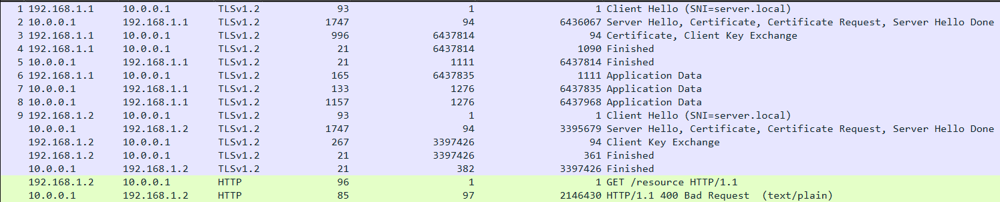

# my CTF - BackGround

This repository provides a simple implementation of a vulnerable server and client that communicate over TLS.


## Table of Contents

- [Frame story](#frame-story)
- [Subjects](#subjects)
- [Challenge Steps](#challenge-steps)
- [Usage](#usage)
  - [PCAP Creation Overview](#pcap-creation)
    - [TLS Handshake Steps](#tls-handshake-steps)
    - [Client Hello](#client-hello)
    - [Server Hello](#server-hello)
    - [Client Key Exchange](#client-key-exchange)
    - [Calculate Master Secret](#calculate-master-secret)
    - [Client Change Cipher Spec](#client-change-cipher-spec)
    - [Server Change Cipher Spec](#server-change-cipher-spec)
    - [Create SSLKeyLog File](#create-sslkeylog-file)
    - [Application Data Encryption](#application-data-encryption)
      - [issue](#issue)
  - [Create Communication](#create-communication)
    - [Server File](#server-file)
    - [Client no-cert File](#client-no-cert-file)
    - [Client cert File](#client-cert-file)
    - [Protocol File](#protocol-file)
    - [PE stole](#pe-stole)
- [Building and Integration](#building-and-integration)
- [Known Limitations](#known-limitations)
- [Contributing](#contributing)
- [License](#license)

## Challenge Description

The challenge is themed around the Ritchie Boys, a historical group of German-born individuals recruited by the US Army in World War II for intelligence and psychological warfare against Nazi Germany.
In the context of the challenge, the Ritchie Boys Force is revived in 2025 to combat Iran's Islamic Revolutionary Guard Corps.
The player's goal is to compromise an Iranian server and extract the encryption key used for the organization's radio communications.

## Subjects
The challenge covers various skills including:
1. Wireshark: Network traffic analysis
2. Python scripting: PCAP Creation with Scapy, Socket programming.
3. Operating System knowledge: PE format and forensic analyzing
4. Cryptography: Encryption keys and file decryption
5. HTTP protocol: Analysis and bug identification
6. Reverse Engineering: Embedding exe in pdf.
7. PCAP creation with Scapy.
8. Protocol analysis tools: TShark and OpenSSL in WSL environment

## Challenge Steps

1. Revealing the Files

    - Start with mission.pdf
    - Extract hidden files:
        - server.exe
        - Corrupted client.exe
    - Use steganography techniques

2. Client Fix
    - Run server.exe to get encryption key (random character sequence)
    - Write Python script to decrypt client.exe
    - Make client.exe executable

3. Communication Analysis
    - Run server.exe and client.exe simultaneously
    - Analyze capture.pcapng from mission.pdf
    - Discover server's requirement: send resource only to clients with Certificate during TLS Handshake

4.  Creating Another Client
    - Create client2.exe
    - Must connect concurrently with original client
    - Ensure client2.exe is unique to avoid server treating it as duplicate
    - Difference: client1 doesn't load certificate, client2 does

5. Self-Signed Certificate
    - Generate self-signed certificate without CA
    - Integrate certificate into client2 code
    - Ensure server recognizes certificate during TLS handshake
    - Possible localhost domain setup
    - Be prepared for server expecting DER format instead of CRT

6. CRS File Verification
    - After loading certificate, client2 must also load CRS file
    - Verifies proper certificate creation steps
    - Prevents bypass using Python script

7. Capturing the Resource
    - client2 receives resource.png from server
    - Image contains flag in plain sight
    - Participants submit flag to complete challenge

## Usage

Your explanation and structure for the **PCAP Creation** process, along with the associated **UnifiedTLSSession** class, is excellent! Here's a refined breakdown and some additional enhancements you might consider:

---

### **PCAP Creation Overview**



The **UnifiedTLSSession** class facilitates the simulation of a TLS session between a client and a server, enabling the creation of PCAP files.
Core Features:
1. **TLS Handshake**: Simulates certificate exchange and encryption negotiation to establish a secure connection.
2. **Application Data Exchange**: Supports both encrypted (TLS) and unencrypted (HTTP) communication based on session configuration.

Example: Generating a PCAP File
```python
def main():
    logging.info("\n--- Client 1 Session ---")
    client1_session = UnifiedTLSSession(
        pcap_writer = writer,
        client_ip = config.CLIENT1_IP,
        server_ip = config.SERVER_IP,
        client_port=12345,
        server_port=443,
        use_tls=True,
        use_client_cert=True
    )
    client1_session.run_session(
        config.GET_REQUEST,
        config.OK_RESPONSE,
        'ctf_challenge.gif'
    )

    logging.info("\n--- Client 2 Session ---")
    client2_session = UnifiedTLSSession(
        pcap_writer = writer,
        client_ip = config.CLIENT2_IP,
        server_ip = config.SERVER_IP,
        client_port=12346,
        server_port=443,
        use_tls=True,
        use_client_cert=False
    )
    client2_session.run_session(
        config.GET_REQUEST,
        config.BAD_REQUEST
    )

    writer.save_pcap(config.OUTPUT_PCAP)
```
---
#### **Explanation**

1. **Client 1 Session:**
   - Initiates a secure TLS handshake with the server.
   - Sends a valid GET request and receives a response containing a GIF file (`ctf_challenge.gif`).

2. **Client 2 Session:**
   - Attempts to connect but does not provide a client certificate.
   - Receives a `400 Bad Request` response due to certificate verification failure.

3. **PCAP File Generation:**
   - The `writer.save_pcap` method writes the recorded packets to the specified file (`config.OUTPUT_PCAP`).
   - The `writer.verify_and_log_packets` method ensures the correctness of the generated PCAP and logs any discrepancies.

---

### TLS Handshake Steps
TLS Handshake Steps: Functions for each step of the TLS handshake, including ClientHello, ServerHello, key exchange, and setting up secure communication.
```python
def perform_handshake(self)-> None:
        """
        Executes the TLS handshake process according to RFC 5246.
        """
        # Step 1: Client Hello
        self.send_client_hello()
        
        # Step 2: Server Hello, Certificate, ServerKeyExchange (if needed), ServerHelloDone
        self.send_server_hello()
        
        # Step 3: Client (RSA) Key Exchange (and Client Certificate if required)
        self.send_client_key_exchange()
        
        # Step 4: Generate Master Secret
        self.handle_master_secret()
        
        # Step 5: Client ChangeCipherSpec and Finished
        self.send_client_change_cipher_spec()
        
        # Step 6: Server ChangeCipherSpec and Finished
        self.send_server_change_cipher_spec()
        
        # Log SSL keys for Wireshark
        self.handle_ssl_key_log()
```
---
### **Detailed Explanations**
#### **1. Client Hello**
- **Purpose:** Initiates the handshake by sending the supported ciphers, extensions, and random bytes.
- **Key Components:**
  - **Client Random:** Combines current time (`GMT Unix time`) and random bytes for session identification.
  - **Supported Ciphers:** Lists encryption algorithms supported by the client.
```python
def send_client_hello(self)-> None:
        self.client_GMT_unix_time, self.client_random_bytes = generate_random()
        self.client_random = self.client_GMT_unix_time.to_bytes(4, 'big') + self.client_random_bytes
        logging.info(f"Generated client_random: {self.client_random.hex()}")
        
        client_hello = TLSClientHello(
            version=0x0303,  # TLS 1.2
            ciphers=[TLS_RSA_WITH_AES_128_CBC_SHA256],
            ext=[
                TLS_Ext_ServerName(servernames=[ServerName(servername=f"{self.server_name}.local".encode())]),
                TLS_Ext_EncryptThenMAC(),
                TLS_Ext_SupportedGroups(groups=["x25519"]),
                TLS_Ext_SignatureAlgorithms(sig_algs=["sha256+rsa"]),
            ],
            gmt_unix_time=self.client_GMT_unix_time,
            random_bytes=self.client_random_bytes
        )
        self.send_to_server(client_hello)
```
#### Explanation:
1. **Client Random:** Combines the GMT Unix timestamp and 28 random bytes.
2. **Supported Ciphers:** Advertises the supported algorithms for encryption and hashing.
3. **Extensions:** Adds optional features like server name indication, supported groups, and signature algorithms.
---
#### **2. Server Hello**
- **Purpose:** Responds to the `Client Hello` by selecting encryption parameters and generating the server’s random bytes.
- **Key Components:**
  - **Server Random:** Similar to the client random, used in key generation.
  - **Session ID:** Unique identifier for the session.
```python
def send_server_hello(self)-> None:      
        # Generate a Server Random
        self.server_GMT_unix_time, self.server_random_bytes = generate_random()
        self.server_random = self.server_GMT_unix_time.to_bytes(4, 'big') + self.server_random_bytes
        logging.info(f"Generated server_random: {self.server_random.hex()}")

        server_hello = TLSServerHello(
            version=0x0303,  # TLS 1.2
            gmt_unix_time=self.server_GMT_unix_time,
            random_bytes=self.server_random_bytes,
            sid = os.urandom(32),
            cipher=TLS_RSA_WITH_AES_128_CBC_SHA256.val,
            ext=[
                TLS_Ext_SignatureAlgorithms(sig_algs=['sha256+rsaepss']),
                TLS_Ext_ExtendedMasterSecret(),
                TLS_Ext_EncryptThenMAC()
                ]
            )
        
        certificate = TLSCertificate(certs=cert_entries)

        cert_request = TLSCertificateRequest(
            ctypes=[1],  # RSA certificate type
            sig_algs=[0x0401],  # SHA256 + RSA
            certauth=[
                (len(ca_dn), ca_dn)  # Use only the Distinguished Name
            ]
        )
        self.send_to_client(server_hello, certificate, cert_request, TLSServerHelloDone())
```
#### Explanation:
1. **Server Random:** Combines a timestamp and random bytes for key generation.
2. **Selected Cipher:** Agrees upon one cipher suite from the client’s list.
3. **Extensions:** Adds advanced security options like extended master secrets.

---
#### **3. Client Key Exchange**
- **Purpose:** Shares the pre-master secret with the server, encrypted using the server’s public key.
- **Key Components:**
  - **Pre-Master Secret:** Used to derive the master secret for symmetric encryption.
  - **Encrypted Pre-Master Secret:** Secures the shared secret during transit.
```python
def send_client_key_exchange(self)-> None:

        # Client Certificate Handle
        client_certificate = TLSCertificate(certs=[(len(cert_der), cert_der)])
        self.handshake_messages.append(raw(client_certificate))

        # Client (RSA) Key Exchange
        self.pre_master_secret = generate_pre_master_secret()
        self.encrypted_pre_master_secret = encrypt_pre_master_secret(
            self.pre_master_secret, 
            self.server_public_key
        )
                    
        # Prepare key exchange message
        # validate the length of the encrypted pre-master secret
        length_bytes = len(self.encrypted_pre_master_secret).to_bytes(2, 'big')

        client_key_exchange = TLSClientKeyExchange(
            exchkeys=length_bytes + self.encrypted_pre_master_secret
        )
        self.send_to_server(client_certificate, client_key_exchange)
```
#### Explanation:
1. **Pre-Master Secret:** Randomly generated and encrypted with the server’s public key.
2. **Encrypted Transmission:** Ensures the server is the only entity that can decrypt the secret.

---

#### Calculate Master Secret
```python
def handle_master_secret(self)-> None:
        # Before generating the master secret,
        # try to decrypt the pre-master secret with server's private key
        try:
            decrypted_pre_master_secret = decrypt_pre_master_secret(self.encrypted_pre_master_secret, self.server_private_key)
        except Exception as e:
            raise ValueError("Pre-master secret does not match") from e

        # Compute master secret
        self.master_secret = self.prf.compute_master_secret(
            self.pre_master_secret,
            self.client_random,
            self.server_random
        )
        print(f"Master secret: {self.master_secret.hex()}")
        # Derive key material
        key_block = self.prf.derive_key_block(
            self.master_secret,
            self.server_random,
            self.client_random,
            2 * (16 + 32 + 16)  # 2 * (key_length + mac_key_length + iv_length)
        )
        self.client_write_key = key_block[:16]
        self.server_write_key = key_block[16:32]
        self.client_write_mac_key = key_block[32:64]
        self.server_write_mac_key = key_block[64:96]
        self.client_write_IV = key_block[96:112]
        self.server_write_IV = key_block[112:128]
```

#### Client Change Cipher Spec
```python
def send_client_change_cipher_spec(self)-> None:
        client_verify_data = self.prf.compute_verify_data(
            'client',
            'write',
            b''.join(self.handshake_messages),
            self.master_secret
        )
        client_finished = TLSFinished(vdata=client_verify_data)
        """sent by both the client and the
            server to notify the receiving party that subsequent records will be
            protected under the newly negotiated CipherSpec and keys."""
        self.tls_context.msg = [TLSChangeCipherSpec()]
        self.tls_context.msg = [client_finished]
        self.send_tls_packet(self.client_ip, self.server_ip, self.client_port, self.server_port)
```
Explain:

#### Server Change Cipher Spec packet
```python
def send_server_change_cipher_spec(self):
        # Server Finished
        server_verify_data = self.prf.compute_verify_data(
            'server',
            'write',
            b''.join(self.handshake_messages),
            self.master_secret
        )

        decrypted_pre_master_secret = decrypt_pre_master_secret(self.encrypted_pre_master_secret, self.server_private_key)
        
        logging.info(f"Server decrypted pre_master_secret: {decrypted_pre_master_secret.hex()}")

        finished = TLSFinished(vdata=server_verify_data)
        
        self.tls_context.msg = [TLSChangeCipherSpec()]
        self.tls_context.msg = [finished]
        self.send_tls_packet(self.server_ip, self.client_ip, self.server_port, self.client_port)
        logging.info(f"Server Finished sent to {self.client_ip}")
```

#### Create SSLKeyLog File
```python
def handle_ssl_key_log(self):
        try:
            # Log SSL key for Wireshark decryption
            log_line = f"CLIENT_RANDOM {self.client_random.hex()} {self.master_secret.hex()}"
            with open(self.pcap_writer.config.SSL_KEYLOG_FILE, "a") as f:
                f.write(log_line + "\n")
            logging.info(f"Logged master secret to {self.pcap_writer.config.SSL_KEYLOG_FILE}: {log_line}")
        except Exception as e:
            logging.error(f"Failed to derive master secret for decryption: {str(e)}")
            raise e
            
        # check if the SSLKEYLOG's master secret is correct
        if verify_master_secret(self.client_random, self.master_secret, self.pcap_writer.config.SSL_KEYLOG_FILE):
            logging.info(f"Derived master_secret: {self.master_secret.hex()}")
        else:
            raise Exception("Master secret verification failed")
```
#### Application Data Encryption
Code for encrypting and decrypting application data using AES-128-CBC with HMAC-SHA256.
```python
def send_application_data(self, data, is_request):
        is_client = is_request
        key = self.client_write_key if is_client else self.server_write_key
        mac_key = self.client_write_mac_key if is_client else self.server_write_mac_key
        
        iv = os.urandom(16)  # Generate a new IV for each message
        
        # Encrypt the data using CBC mode with HMAC-SHA256 for integrity
        encrypted_data = encrypt_tls12_record_cbc(data, key, iv, mac_key)
        self.encrypted_packets.append(encrypted_data)
        self.original_messages.append(data)
        
        # שמור את המפתח וה-IV
        self.packet_keys.append(key)
        self.packet_ivs.append(iv)
        self.packet_mac_keys.append(mac_key)
        
        # Create a TLS Application Data record
        tls_data = TLSApplicationData(data=encrypted_data)
        self.tls_context.msg = [tls_data]
        
        src_ip = self.client_ip if is_request else self.server_ip
        dst_ip = self.server_ip if is_request else self.client_ip
        sport = self.client_port if is_request else self.server_port
        dport = self.server_port if is_request else self.client_port
        
        # Send the encrypted TLS packet
        self.send_tls_packet(src_ip, dst_ip, sport, dport)
```
##### issue
An issue is noted with SSL keylog decryption in Wireshark, and potential reasons are explored.

- I looked on the Wireshark Open Source for understand how they are implement the decryption.
This trying worked a little bit......

- Checking a "real pcap" decryption procces and compare with my pcap, with TShark commands.
```bash
tshark -r <pcap_name.pcap> \
    -o "tls.keylog_file:<sslkeylog_name.log>" \
    -o "tls.debug_file:<tls_debug_name.txt>" \
    -V
```
The issue is not with: sslkeylog details, pre master secret, ............
מצאתי שתהליך הפענוח הוא כזה:
תחילה, נבדק XXX
אח"כ XXX
אח"כ XXX
לא אמורה להיות בעיה כאן כי...

- I though maby the issue is the fact I used Self Signed Certificate and no CA sigend for server, so OS not בוטחת in that. But this thing only for the 
- .
- .
- .

### Create Communication
```python

```

#### Server File
Explain:
    1. Turn client certificate: If client connected without turn a certificate (as client1.exe), so tell him to use self signed cert.
    2. Turn CSR: Additionly, added another verify, for be sure the client used a real cert he created by own, and not used a python script for that.
```python
def handle_client_request(ssl_socket):
    try:
        # Check for client certificate
        cert = ssl_socket.getpeercert(binary_form=True)
        if not cert:
            print("No client certificate provided")
            response = "HTTP/1.1 400 Bad Request\r\nContent-Type: text/plain\r\n\r\n"
            response += "Hint: Use a self-signed certificate (Country: IL, CN: Pasdaran.local) to access the resource."
            ssl_socket.sendall(response.encode())
            return False
        
        print("Client certificate received.")
        
        # Request CSR file
        response = "HTTP/1.1 100 Continue\r\nContent-Type: text/plain\r\n\r\n"
        response += "Please provide your CSR file for verification."
        ssl_socket.sendall(response.encode())
        print("Requested CSR file from client")
        
        # Wait for CSR file
        csr_data = b""
        while True:
            chunk = ssl_socket.recv(4096)
            if not chunk:
                break
            csr_data += chunk
            if b"-----END CERTIFICATE REQUEST-----" in csr_data:
                break
        
        csr_data = csr_data.decode()
        print(f"Received CSR data (length: {len(csr_data)} bytes)")
        
        if verify_client_cert(cert, csr_data):
            response = "HTTP/1.1 200 OK\r\nContent-Type: text/plain\r\n\r\n"
            response += "FLAG{This_Is_Your_Secret_Flag}"
        else:
            response = "HTTP/1.1 400 Bad Request\r\nContent-Type: text/plain\r\n\r\n"
            response += "Invalid certificate or CSR. Access denied."
        
        print(f"Sending response: {response}")
        ssl_socket.sendall(response.encode())
        print("Response sent successfully")
        return True
    except Exception as e:
        print(f"Error handling client: {e}")
        return False
```
Explain:

```python
def server():
    global running
    context = ssl.SSLContext(ssl.PROTOCOL_TLSv1_2)
    context.set_ciphers('AES128-SHA256')
    context.load_cert_chain(certfile="server.crt", keyfile="server.key")
    context.verify_mode = ssl.CERT_OPTIONAL  # Allow optional client cert
    context.check_hostname = False
    context.verify_flags = ssl.VERIFY_DEFAULT | ssl.VERIFY_X509_TRUSTED_FIRST
    context.load_verify_locations(cafile="client.crt")  # Trust the client's self-signed cert

    server_socket = socket.socket(socket.AF_INET, socket.SOCK_STREAM)
    server_socket.bind((protocol.SERVER_IP, protocol.SERVER_PORT))
    server_socket.listen(5)
    server_socket.setblocking(False)  # Set socket to non-blocking mode

    print(f"Server is up and running, waiting for a client on port {protocol.SERVER_PORT}...")
    print("Press Ctrl+C to stop the server.")

    start_time = time.time()
    key_printed = False

    # Set up the signal handler
    signal.signal(signal.SIGINT, signal_handler)

    try:
        while running:
            # Use select to wait for a connection with a short timeout
            ready, _, _ = select.select([server_socket], [], [], 0.1)
            
            if ready:
                client_socket, client_address = server_socket.accept()
                print(f"Client connected from {client_address}")

                try:
                    ssl_socket = context.wrap_socket(client_socket, server_side=True)
                    print("SSL handshake successful")
                    print(f"Using cipher: {ssl_socket.cipher()}")
                    print(f"SSL version: {ssl_socket.version()}")
                    
                    if handle_client_request(ssl_socket):
                        print("Client request handled successfully")
                    else:
                        print("Failed to handle client request")
                except ssl.SSLError as e:
                    print(f"SSL Error: {e}")
                except Exception as e:
                    print(f"Unexpected error: {e}")
                finally:
                    ssl_socket.close()
                    print("Connection closed")
            else:
                # No connection within the timeout period
                if not key_printed and time.time() - start_time > 5:
                    print_encryption_key()
                    key_printed = True
                print("Waiting for a new connection...", end='\r')
    
    finally:
        print("\nClosing server socket...")
        server_socket.close()
        print("Server has been shut down.")
```

#### Client no-cert File
```python
def main():
    # Initialize the socket
    my_socket = socket.socket(socket.AF_INET, socket.SOCK_STREAM)
    
    # Connect to the server
    print(f"Connecting to {'127.0.0.1'}:{protocol.SERVER_PORT}")
    my_socket.connect(('127.0.0.1', protocol.SERVER_PORT))
    
    # Send a "Hello" message to the server
    message = "Hello"
    my_socket.send(message.encode())
    print(f"Sent: {message}")

    # Receive a response from the server
    response = my_socket.recv(1024).decode()
    print(f"Received: {response}")
    
    # Close the socket
    my_socket.close()
```

#### Client cert File
```python
def client():
    context = ssl.create_default_context(ssl.Purpose.SERVER_AUTH)
    context.load_cert_chain(certfile="client.crt", keyfile="client.key")
    context.check_hostname = False
    context.verify_mode = ssl.CERT_NONE

    with socket.create_connection(('localhost', 443)) as sock:
        with context.wrap_socket(sock, server_hostname='localhost') as secure_sock:
            print(f"Connected to {secure_sock.getpeername()}")
            secure_sock.send(b"GET /resource HTTP/1.1\r\nHost: localhost\r\n\r\n")
            
            response = b""
            while True:
                chunk = secure_sock.recv(4096)
                if not chunk:
                    break
                response += chunk
            
            print(f"Received response of {len(response)} bytes")
```

#### Protocol File
```python
MAX_MSG_LENGTH = 1024
SERVER_PORT = 8110
SERVER_IP = "0.0.0.0"
ENCRYPTION_KEY = "RandomEncryptionKey123!@#"
```

### PE stole
PDF Structure Hint

The PDF file contains two hidden executables:

1. server.exe: A standard PE file
2. client1.exe: An encrypted PE file

Structure:
[PDF Content]
[server.exe (PE format)]
[Magic Number: 0xDEADBEEF + Encrypted Key]
[Encrypted client1.exe]

Hint: 
- Look for the PE header to find the start of server.exe. 
- The magic number 0xDEADBEEF marks the end of server.exe and the start of the encrypted client1.exe.
- The encryption key for client1.exe is hidden within the magic number itself.

Challenge:
Can you find the encryption key hidden in the magic number? 
It's not just 0xDEADBEEF - there's more to it!

## Analyzing Protocol Tools

used:
```bash
tshark -r <pcap_file> \
    -o"tls.keylog_file:<path_to_sslkeylog_file>" \
    -d "tcp.port==<port>,tls" \
    -Y "tls.app_data" \
    -T fields \
    -e tls.app_data
```
tshark -r new_output.pcap \
    -o "tls.keylog_file:sslkeylog_sniffEx.log" \
    -d "tcp.port==443,tls" \
    -Y "tls.app_data" -T fields \
    -e tls.app_data


```bash
tshark -r new_output.pcap \
    -o "tls.keylog_file:sslkeylog_sniffEx.log" \
    -o "tls.debug_file:tls_debug.txt" \
    -V
```

```bash
tshark -r output.pcap \
     -o "tls.keylog_file:sslkeylog_ctf.log" \
     -d "tcp.port==443,tls" \
     -o "tls.debug_file:tls_debug.txt" \
     -Y "tls && ip.src == 192.168.1.1" \
     -T fields \
     -e frame.number \
     -e tls.record.content_type \
     -e tls.handshake.type \
     -e tls.app_data
```
## Known Limitations


Create Signed Self Certificate:
create private key
```bash
openssl genpkey \
-algorithm RSA \
-out server.key \
-pkeyopt rsa_keygen_bits:2048
```
create csr:
```bash
openssl req \
-new -key server.key \
-out server.csr \
-subj "/C=IR/ST=xxx/L=xxx/O=xxx/OU=xxx/CN=xxx"
```
חתימה ע"י OpenSSL
```bash
openssl x509 \
-req -days 365 \
-in server.csr \
-signkey server.key \
-out server.crt
```
המרה לder
```bash
openssl x509 \
-req -days 365 \
-in server.csr \
-signkey server.key \
-out server.crt
```
extrach public key:
```bash
openssl rsa \
-in server.key \
-pubout \
-out server.pub
```
- **No Padding Support**: Ensure that your data length is a multiple of 16 bytes, as the algorithm processes data in 16-byte blocks. Padding is not supported.

## Contributing

Feel free to contribute to the project by opening issues or pull requests.

## License

This project is licensed under the MIT License - see the [LICENSE](LICENSE) file for details.


## הנחיות למשתתף (ליצירת תעודת לקוח)
הנה המדריך למערכת האישורים:

1. הכנת ה-CA:
```bash
# יצירת מפתח CA
openssl genrsa -out guards.key 2048

# יצירת תעודת CA
openssl req -x509 -new -nodes -key guards.key -sha256 -days 3650 -out guards.crt \
-subj "/CN=CTF CA/C=IL"
```

2. קוד השרת יטען את ה-CA:
```python
context.load_verify_locations(cafile="guards.crt")
```

3. הוראות למשתתפים:
```bash
# יצירת מפתח פרטי
openssl genrsa -out client.key 2048

# יצירת בקשת חתימה (CSR)
openssl req -new -key client.key -out client.csr \
-subj "/CN=Pasdaran.local/C=IL"

# חתימת התעודה עם ה-CA
openssl x509 -req -in client.csr -CA guards.crt -CAkey guards.key \
-CAcreateserial -out client.crt -days 365
```

כך המשתתפים יוכלו ליצור תעודות חתומות על ידי ה-CA שלך.

סדר הפעולות:

לקוח שולח client.crt לשרת
שרת בודק אם התעודה חתומה על ידי ca.crt שהוא מכיר
אם כן, השרת בודק את התכונות של התעודה ב-verify_client_cert


# Install pyinstaller:
pip install pyinstaller

# Create EXEs:
pyinstaller --onefile server.py
pyinstaller --onefile basic_client.py