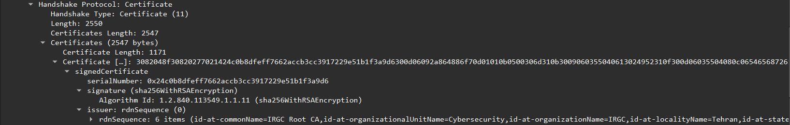

# CTF Challenge: TLS Handshake and Encryption Algorithms

## **Introduction**
This repository contains a Capture The Flag (CTF) challenge that simulates vulnerabilities in TLS communication. Participants will analyze traffic, fix clients, and create secure communications using cryptography, reverse engineering, and network analysis tools.


pip install -r requirements.txt

## Table of Contents
- [Challenge Description](#challenge-description)
- [Subjects](#subjects)
- [Usage](#usage)
    - [PCAP Creation Overview](#pcap-creation-overview)
        - [TLS Handshake Steps](#tls-handshake-steps)
        - [Client Hello](#client-hello)
        - [Server Hello](#server-hello)
        - [Client Key Exchange](#client-key-exchange)
        - [Calculate Master Secret](#calculate-master-secret)
        - [Client Change Cipher Spec](#client-change-cipher-spec)
        - [Server Change Cipher Spec](#server-change-cipher-spec)
        - [Create SSLKeyLog File](#create-sslkeylog-file)
            - [issue](#issue)
        - [Application Data Encryption](#application-data-encryption)
    - [SSL Communication Overview](#ssl-communication-overview)
        - [CA Server](#ca-server)
        - [CSR Client](#csr-client)
        - [Server](#server)
        - [Advanced Client Handle](#advanced-client-handle)
    - [External Services Overview](#external-services-overview)
        - [PE stole](#pe-stole)
- [Challenge Steps](#challenge-steps)
- [Participants Solution](#participants-solution)
- [External Tools](#external-tools)
- [Known Limitations](#known-limitations)
- [Contributing](#contributing)
- [License](#license)

## Challenge Description

The challenge is themed around the Ritchie Boys, a historical group of German-born individuals recruited by the US Army in World War II for intelligence and psychological warfare against Nazi Germany.
In the context of the challenge, the Ritchie Boys Force is revived in 2025 to combat Iran's Islamic Revolutionary Guard Corps.
The player's goal is to compromise an Iranian server and extract the encryption key used for the organization's radio communications.

Here's the improved version of the **Subjects** section:

---

## Subjects
This challenge develops a broad range of technical skills, including:

1. **Network Traffic Analysis**:
   - Using Wireshark to analyze captured network packets.
   
2. **Python Scripting**:
   - Creating PCAP files with Scapy.
   - Implementing socket programming for communication emulation.

3. **Operating System Forensics**:
   - Analyzing PE file formats.
   - Applying forensic techniques for hidden data extraction.

4. **Cryptography**:
   - Understanding encryption key generation and usage.
   - Decrypting files and securing communication.

5. **HTTP Protocol Analysis**:
   - Identifying and exploiting bugs in HTTP communications.

6. **Reverse Engineering**:
   - Extracting and embedding executable files within PDFs.

7. **PCAP File Creation**:
   - Simulating network interactions and capturing them for analysis with Scapy.

8. **Protocol Analysis Tools**:
   - Leveraging TShark for deeper protocol inspection.
   - Using OpenSSL for TLS/SSL operations in a WSL environment.

---


## Usage


---

### **PCAP Creation Overview**


The **UnifiedTLSSession** class facilitates the simulation of a TLS session between a client and a server, enabling the creation of PCAP files.
Core Features:
1. **TLS Handshake**: Simulates certificate exchange and encryption negotiation to establish a secure connection.
2. **Application Data Exchange**: Supports both encrypted `TLS` and unencrypted `HTTP` communication based on session configuration.

```python
def main():
    logging.info("\n--- Client 1 Session ---")
    client1_session = UnifiedTLSSession(
        pcap_writer = writer,
        client_ip = config.CLIENT1_IP,
        server_ip = config.SERVER_IP,
        client_port=12345,
        server_port=443,
        use_tls=True,
        use_client_cert=True
    )
    client1_session.run_session(
        config.GET_REQUEST,
        config.OK_RESPONSE,
        'ctf_challenge.gif'
    )

    logging.info("\n--- Client 2 Session ---")
    client2_session = UnifiedTLSSession(
        pcap_writer = writer,
        client_ip = config.CLIENT2_IP,
        server_ip = config.SERVER_IP,
        client_port=12346,
        server_port=443,
        use_tls=True,
        use_client_cert=False
    )
    client2_session.run_session(
        config.GET_REQUEST,
        config.BAD_REQUEST
    )

    writer.save_pcap(config.OUTPUT_PCAP)
```
#### **Explanation**

1. **Client 1 Session:**
   - Initiates a secure TLS handshake with the server.
   - Sends a valid GET request and receives a response containing a GIF file (`ctf_challenge.gif`).

2. **Client 2 Session:**
   - Attempts to connect but does not provide a client certificate.
   - Receives a `400 Bad Request` response due to certificate verification failure.

3. **PCAP File Generation:**
   - The `writer.save_pcap` method writes the recorded packets to the specified file (`config.OUTPUT_PCAP`).
   - The `writer.verify_and_log_packets` method ensures the correctness of the generated PCAP and logs any discrepancies.

---
### TLS Handshake Steps
TLS Handshake Steps: Functions for each step of the TLS handshake, including ClientHello, ServerHello, key exchange, and setting up secure communication.
```python
def perform_handshake(self)-> None:
        """
        Executes the TLS handshake process according to RFC 5246.
        """
        # Step 1: Client Hello
        self.send_client_hello()
        
        # Step 2: Server Hello, Certificate, ServerKeyExchange (if needed), ServerHelloDone
        self.send_server_hello()
        
        # Step 3: Client (RSA) Key Exchange (and Client Certificate if required)
        self.send_client_key_exchange()
        
        # Step 4: Generate Master Secret
        self.handle_master_secret()
        
        # Step 5: Client ChangeCipherSpec and Finished
        self.send_client_change_cipher_spec()
        
        # Step 6: Server ChangeCipherSpec and Finished
        self.send_server_change_cipher_spec()
        
        # Log SSL keys for Wireshark
        self.handle_ssl_key_log()
```
---
#### **Client Hello**
**Purpose**: The client Initiates the handshake by sending the supported `ciphers`, `extensions`, and `random` bytes.
```python
def send_client_hello(self)-> None:
        self.client_GMT_unix_time, self.client_random_bytes = generate_random()
        self.client_random = self.client_GMT_unix_time.to_bytes(4, 'big') + self.client_random_bytes
        logging.info(f"Generated client_random: {self.client_random.hex()}")
        
        client_hello = TLSClientHello(
            version=0x0303,  # TLS 1.2
            ciphers=[TLS_RSA_WITH_AES_128_CBC_SHA256],
            ext=[
                TLS_Ext_ServerName(servernames=[ServerName(servername=f"{self.server_name}.local".encode())]),
                TLS_Ext_EncryptThenMAC(),
                TLS_Ext_SupportedGroups(groups=["x25519"]),
                TLS_Ext_SignatureAlgorithms(sig_algs=["sha256+rsa"]),
            ],
            gmt_unix_time=self.client_GMT_unix_time,
            random_bytes=self.client_random_bytes
        )
        self.send_to_server(client_hello)
```
 ***Explanation:***
1. **Client Random:** Combines the GMT Unix timestamp and 28 random bytes.
2. **Supported Ciphers:** Advertises the supported algorithms for encryption and hashing.
3. **Extensions:** Adds optional features like server name indication, supported groups, and signature algorithms.

---

#### **Server Hello**
**Purpose**: Responds to the `Client Hello` by  server `random` bytes`selected cipher` (encryption parameters) and `extenstions`.
```python
def send_server_hello(self)-> None:      
        # Generate a Server Random
        self.server_GMT_unix_time, self.server_random_bytes = generate_random()
        self.server_random = self.server_GMT_unix_time.to_bytes(4, 'big') + self.server_random_bytes
        logging.info(f"Generated server_random: {self.server_random.hex()}")

        server_hello = TLSServerHello(
            version=0x0303,  # TLS 1.2
            gmt_unix_time=self.server_GMT_unix_time,
            random_bytes=self.server_random_bytes,
            sid = os.urandom(32),
            cipher=TLS_RSA_WITH_AES_128_CBC_SHA256.val,
            ext=[
                TLS_Ext_SignatureAlgorithms(sig_algs=['sha256+rsaepss']),
                TLS_Ext_ExtendedMasterSecret(),
                TLS_Ext_EncryptThenMAC()
                ]
            )
        
        certificate = TLSCertificate(certs=cert_entries)

        cert_request = TLSCertificateRequest(
            ctypes=[1],  # RSA certificate type
            sig_algs=[0x0401],  # SHA256 + RSA
            certauth=[
                (len(ca_dn), ca_dn)  # Use only the Distinguished Name
            ]
        )
        self.send_to_client(server_hello, certificate, cert_request, TLSServerHelloDone())
```
 ***Explanation:***
1. **Server Random:** Combines a timestamp and random bytes for key generation.
2. **Selected Cipher:** Agrees upon one cipher suite from the client’s list.
3. **Extensions:** Adds advanced security options like extended master secrets.


---

#### Client Key Exchange
**Purpose**: The client generates a `Pre-Master Secret`, encrypts it, and sends it to the server.
This secret is encrypted using the server's `public key`, making it accessible only to the intended recipient.
```python
def send_client_key_exchange(self)-> None:

        # Client Certificate Handle
        client_certificate = TLSCertificate(certs=[(len(cert_der), cert_der)])
        self.handshake_messages.append(raw(client_certificate))

        # Client (RSA) Key Exchange
        self.pre_master_secret = generate_pre_master_secret()
        self.encrypted_pre_master_secret = encrypt_pre_master_secret(
            self.pre_master_secret, 
            self.server_public_key
        )

        client_key_exchange = TLSClientKeyExchange(
            exchkeys=length_bytes + self.encrypted_pre_master_secret
        )

        self.send_to_server(client_certificate, client_key_exchange)


```
 ***Explanation:***
1. **Client Certificate:** A TLS certificate representing the client is prepared and appended to the handshake messages.
2. **Pre-Master Secret:** A randomly generated `pre-master secret` is created for the session.
This value serves as the foundation for deriving the `master secret` used in subsequent encryption.
3. **Encryption:** The `pre-master secret` is encrypted using the `server's public key`, ensuring secure transmission.
The encryption guarantees that only the server, possessing the corresponding `private key`, can decrypt it.
4. **Key Exchange Message:** The encrypted `pre-master secret` is packaged into a key exchange message, preceded by its length in bytes.

Notice:
ב-TLS 1.2, כאשר משתמשים ב-RSA Key Exchange, לא נשלחת הודעת ServerKeyExchange.
תהליך ה-Handshake מבוסס על הצפנה של Pre-Master Secret עם המפתח הציבורי של השרת, ולכן אין צורך בחתימה נוספת מצד השרת כדי לוודא את הזהות שלו.
לעומת זאת, במקרים של Diffie-Hellman (DH) או Elliptic Curve Diffie-Hellman (ECDH), כן נדרשת הודעת ServerKeyExchange.

```python
def encrypt_pre_master_secret(pre_master_secret: bytes, server_public_key: rsa.RSAPublicKey) -> bytes:
    return server_public_key.encrypt(
        pre_master_secret,
        asymmetric_padding.PKCS1v15()
    )
```
The `encrypt_pre_master_secret()` function:
- PKCS1v15 padding (standard for RSA encryption)
- Encrypts the pre-master secret with the server's public key
- Returns the encrypted bytes
---

#### Calculate Master Secret
**Purpose:** The `master secret` is a crucial part of the TLS handshake, derived by both the client and server using the `pre-master secret` and `random` values exchanged during the handshake. It ensures the secure generation of session keys for encryption and integrity checks.


```python
def handle_master_secret(self)-> None:
        """
        Verifies and calculates the Master Secret.
        """
        # Step 1: Decrypt Pre-Master Secret
        decrypted_pre_master_secret = decrypt_pre_master_secret(
            self.encrypted_pre_master_secret,
            self.server_private_key
        )

        # Step 2: Validate Pre-Master Secret
        if compare_to_original(decrypted_pre_master_secret, self.pre_master_secret):
            logging.info("Pre master secret encrypted matches.")

        # Step 3: Compute Master Secret using PRF
        self.master_secret = self.prf.compute_master_secret(
            self.pre_master_secret,
            self.client_random,
            self.server_random
        )
```
 ***Explanation:***
1. **Client Side:**
   - The client encrypts the `pre_master_secret` using the server's public key from its certificate.
   - This ensures that only the server can decrypt it.

2. **Server Side:**
   - The server decrypts the `pre_master_secret` using its private key.
   - This step verifies that the client has a valid server certificate and ensures confidentiality.

3. **Both Sides:**
   - Using the same `pre_master_secret`, along with the `client_random` and `server_random`, both the client and server derive the same `master_secret`.
   - This `master_secret` is the foundation for symmetric encryption keys used in the session.

---

#### Client Change Cipher Spec

**Purpose:** The `ChangeCipherSpec` message is sent by the client to notify the server that it will start using the negotiated encryption and MAC settings. This is immediately followed by the `Finished` message, encrypted with the newly established settings.

```python
def send_client_change_cipher_spec(self)-> None:

        # Compute the client verify data for the Finished message
        client_verify_data = self.prf.compute_verify_data(
                'client',
                'write',
                b''.join(self.handshake_messages),
                self.master_secret
            )

        # Create TLSFinished and ChangeCipherSpec messages
        client_finished = TLSFinished(vdata=client_verify_data)
        change_cipher_spec = TLSChangeCipherSpec()
        self.send_to_server(client_finished)
        self.send_to_server(change_cipher_spec)
```
 ***Explanation:***
1. **Verify Data:**
   - The client computes the `verify_data` using all previous handshake messages and the derived `master_secret`.
   - This ensures the integrity of the handshake.

2. **ChangeCipherSpec Message:**
   - Signals the server that future messages will use the negotiated encryption and integrity settings.

3. **Finished Message:**
   - This is the first message encrypted with the new cipher settings, proving that both client and server share the same session keys.

---
#### Server Change Cipher Spec
- **Purpose:** The server sends the `ChangeCipherSpec` message to notify the client it will use the negotiated encryption settings. It follows with the `Finished` message, encrypted with the new settings, to confirm the handshake.

```python
def send_server_change_cipher_spec(self):
        # Compute the server verify data for the Finished message
            server_verify_data = self.prf.compute_verify_data(
                'server',
                'write',
                b''.join(self.handshake_messages),
                self.master_secret
            )

            # Decrypt pre-master secret for validation (optional)
            decrypted_pre_master_secret = decrypt_pre_master_secret(
                self.encrypted_pre_master_secret,
                self.server_private_key
            )

            # Create TLSFinished and ChangeCipherSpec messages
            server_finished = TLSFinished(vdata=server_verify_data)
            change_cipher_spec = TLSChangeCipherSpec()

            self.send_to_client(server_finished)
            self.send_to_client(change_cipher_spec)
```
 ***Explanation:***
1. **Verify Data:**
   - The server computes `verify_data` using the handshake messages and `master_secret`.
   - Confirms the integrity and authenticity of the handshake.

2. **ChangeCipherSpec Message:**
   - Notifies the client that the server is switching to the negotiated encryption settings.

3. **Finished Message:**
   - Sent encrypted, verifying that the server is ready for secure communication.

Here’s the revised section in the desired format:

---

#### **Create SSLKeyLog File**

- **Purpose:** Enables debugging of encrypted TLS traffic by exporting the `master_secret` and `client_random` to a log file, making it compatible with tools like Wireshark.  

```python
def main():
    # Clear the SSL_KEYLOG_FILE
    with open(config.SSL_KEYLOG_FILE, "w") as f:
        pass

def handle_ssl_key_log(self) -> None:
        """Write keys in the correct format for Wireshark"""
        with open(self.pcap_writer.config.SSL_KEYLOG_FILE, "a") as f:
            # Log master secret with client random
            f.write(f"CLIENT_RANDOM {self.client_random.hex()} {self.master_secret.hex()}\n")
```

***Explanation:***  
1. **Clearing the SSL Key Log File:**  
   - The log file is cleared at the start to ensure no residual data from previous sessions interferes with debugging.  

2. **Writing Keys:**  
   - The `client_random` and `master_secret` are logged in the format:  
     ```
     CLIENT_RANDOM <client_random> <master_secret>
     ```  
   - This allows Wireshark to decrypt the captured traffic by reconstructing session keys.  

3. **Integration with Wireshark:**  
   - The generated log file can be loaded into Wireshark via the *SSL protocol settings* to enable real-time decryption of the TLS packets.  

גזירת ה-master secret  כוללת שימוש בנתונים אקראיים (nonces) שנוצרו על ידי הלקוח והשרת. זה מונע שימוש חוזר ב-master secret  ב sessions שונים, גם אם ה-pre-master secret  נשאר זהה.
בקובץ זה קיים session יחיד לכל לקוח.
אילו היו עוד sessions לכל לקוח, היו מספר של master secret לכל לקוח.

---

### **Notice: SSL Key Log File Decryption Issue**

#### **Context**
The `SSL_KEYLOG_FILE` functionality was implemented to allow decryption of encrypted TLS traffic in tools like Wireshark and TShark. However, during testing, I encountered difficulties in successfully decrypting the `Application Data` packets in both Wireshark and TShark.

#### **Steps Taken to Address the Issue**

1. **Reviewing Wireshark’s Open-Source Code**  
   - I explored the implementation details of how Wireshark processes `sslkeylog` files for decryption. This investigation provided insights into the decryption pipeline but did not reveal any immediate issues with the format or content of the log file generated by my script.  

2. **Comparison with a Valid PCAP File**  
   - I compared the decryption process of a known working PCAP file with my generated PCAP file using the following TShark command:  
     ```bash
     tshark -r <pcap_name.pcap> \
         -o "tls.keylog_file:<sslkeylog_name.log>" \
         -o "tls.debug_file:<tls_debug_name.txt>" \
         -V
     ```
   - This helped identify that the format of the `sslkeylog` file and the `client_random`/`master_secret` entries appeared to be correct.  

3. **Decryption Process Debugging**  
   - Based on my research, the decryption process generally involves:  
     1. Parsing the `Client Random` and `Server Random` values.  
     2. Matching these values to the `sslkeylog` file entries.  
     3. Deriving the session keys for decrypting the traffic.  
   - There did not seem to be an issue with these steps, as the `Client Random` and `Master Secret` were successfully generated and logged.

4. **Consideration of Self-Signed Certificates**  
   - I hypothesized that the use of self-signed certificates might be causing an issue, as they are not trusted by the OS or Wireshark. However, this should not typically prevent decryption if the session keys are correct, as the `sslkeylog` file bypasses the need for certificate validation.

#### **Next Steps**
- Continue investigating the exact reason for the failure, possibly by:
  - Capturing a more detailed debug log using TShark’s `-o tls.debug_file` option.
  - Testing with CA-signed certificates to rule out self-signed certificate-related issues.
  - Exploring alternative TLS libraries or tools to verify the integrity of the generated session keys.

#### **Conclusion**
While the issue remains unresolved, I have documented all attempts and hypotheses. This ensures a clear understanding of the problem and demonstrates due diligence in troubleshooting. Fixing this issue is not a requirement for full credit, as per the instructions, but I will continue to investigate to improve the implementation.  

--- 

Let me know if you'd like further clarification or adjustments.

#### Application Data Encryption
Code for encrypting application data using AES-128-CBC with HMAC-SHA256.
```python
def encrypt_and_send_application_data(self, data, is_request) -> bytes:
    """
    Encrypts and sends TLS application data as per RFC 5246.
    """
    try:
        # Determine client/server context
        is_client = is_request
        key_block = self.prf.derive_key_block(
            self.master_secret,
            self.server_random,
            self.client_random,
            2 * (16 + 32)  # 2 * (key_length + mac_key_length)
        )

        # Extract keys and IV
        client_mac_key = key_block[0:32]
        server_mac_key = key_block[32:64]
        client_key = key_block[64:80]
        server_key = key_block[80:96]

        key = client_key if is_client else server_key
        mac_key = client_mac_key if is_client else server_mac_key
        explicit_iv = os.urandom(16)

        # Generate sequence number
        seq_num = self.client_seq_num if is_client else self.server_seq_num
        seq_num_bytes = seq_num.to_bytes(8, byteorder='big')

        # Encrypt data
        encrypted_data = encrypt_tls12_record_cbc(data, key, explicit_iv, mac_key, seq_num_bytes)

        # Construct TLS record
        tls_record = explicit_iv + encrypted_data
        tls_data = TLSApplicationData(data=tls_record)
        self.tls_context.msg = [tls_data]

        # Update sequence number
        if is_client:
            self.client_seq_num += 1
        else:
            self.server_seq_num += 1

        # Determine source and destination
        src_ip = self.client_ip if is_request else self.server_ip
        dst_ip = self.server_ip if is_request else self.client_ip
        sport = self.client_port if is_request else self.server_port
        dport = self.server_port if is_request else self.client_port

        # Send packet
        raw_packet = self.send_tls_packet(src_ip, dst_ip, sport, dport)

        # Log success
        logging.info(f"TLS Application Data sent from {src_ip}:{sport} to {dst_ip}:{dport}")
        return raw(tls_data)

    except Exception as e:
        logging.error(f"Error in encrypt_and_send_application_data: {e}")
        raise

```


### SSL Communication Overview
שרת CA ולקוח.
שרת רגיל ולקוח.

הלקוח תחילה מבקש מCA שיחתום לו על client csr.
הCA חותם ושולח בחזרה crt file חתום.

#### Server Implementation
Translate to English: השרת מתוכן לבצע TLS Handshake, ומצפה לקבל Client Certificate מהלקוח שמתקשר עמו.
אם לקוח לא הטעין Client Certificate, אז הוא פועל באופן הבא:
שולח encrypted response עם השגיאה שקרתה.
שולח 400 bad request.

```python
def server():
    global running
    context = ssl.SSLContext(ssl.PROTOCOL_TLSv1_2)
    context.set_ciphers('AES128-SHA256')
    context.load_cert_chain(certfile="server.crt", keyfile="server.key")
    context.verify_mode = ssl.CERT_OPTIONAL  # Allow optional client cert
    context.check_hostname = False
    context.verify_flags = ssl.VERIFY_DEFAULT | ssl.VERIFY_X509_TRUSTED_FIRST
    context.load_verify_locations(cafile="client.crt")  # Trust the client's self-signed cert

    server_socket = socket.socket(socket.AF_INET, socket.SOCK_STREAM)
    server_socket.bind((protocol.SERVER_IP, protocol.SERVER_PORT))
    server_socket.listen(5)
    server_socket.setblocking(False)  # Set socket to non-blocking mode

    print(f"Server is up and running, waiting for a client on port {protocol.SERVER_PORT}...")
    print("Press Ctrl+C to stop the server.")

    start_time = time.time()
    key_printed = False

    # Set up the signal handler
    signal.signal(signal.SIGINT, signal_handler)

    try:
        while running:
            # Use select to wait for a connection with a short timeout
            ready, _, _ = select.select([server_socket], [], [], 0.1)
            
            if ready:
                client_socket, client_address = server_socket.accept()
                print(f"Client connected from {client_address}")

                try:
                    ssl_socket = context.wrap_socket(client_socket, server_side=True)
                    print("SSL handshake successful")
                    print(f"Using cipher: {ssl_socket.cipher()}")
                    print(f"SSL version: {ssl_socket.version()}")
                    
                    if handle_client_request(ssl_socket):
                        print("Client request handled successfully")
                    else:
                        print("Failed to handle client request")
                except ssl.SSLError as e:
                    print(f"SSL Error: {e}")
                except Exception as e:
                    print(f"Unexpected error: {e}")
                finally:
                    ssl_socket.close()
                    print("Connection closed")
            else:
                # No connection within the timeout period
                if not key_printed and time.time() - start_time > 5:
                    print_encryption_key()
                    key_printed = True
                print("Waiting for a new connection...", end='\r')
    
    finally:
        print("\nClosing server socket...")
        server_socket.close()
        print("Server has been shut down.")
```

#### Basic Client Handle


```python
def main():
    # Initialize the socket
    my_socket = socket.socket(socket.AF_INET, socket.SOCK_STREAM)
    
    # Connect to the server
    print(f"Connecting to {'127.0.0.1'}:{protocol.SERVER_PORT}")
    my_socket.connect(('127.0.0.1', protocol.SERVER_PORT))
    
    # Send a "Hello" message to the server
    message = "Hello"
    my_socket.send(message.encode())
    print(f"Sent: {message}")

    # Receive a response from the server
    response = my_socket.recv(1024).decode()
    print(f"Received: {response}")
    
    # Close the socket
    my_socket.close()
```

Translate to English:
מוריד קובץ למחשב של המשתתף במיקום קבוע מראש (C:\Users\<user_name>).
לאחר תום ה30 שניות, הקובץ נמחק מהתיקייה.

---

#### Advanced Client Handle

```python
def client():
    context = ssl.create_default_context(ssl.Purpose.SERVER_AUTH)
    context.load_cert_chain(certfile="client.crt", keyfile="client.key")
    context.check_hostname = False
    context.verify_mode = ssl.CERT_NONE

    with socket.create_connection(('localhost', 443)) as sock:
        with context.wrap_socket(sock, server_hostname='localhost') as secure_sock:
            print(f"Connected to {secure_sock.getpeername()}")
            secure_sock.send(b"GET /resource HTTP/1.1\r\nHost: localhost\r\n\r\n")
            
            response = b""
            while True:
                chunk = secure_sock.recv(4096)
                if not chunk:
                    break
                response += chunk
            
            print(f"Received response of {len(response)} bytes")
```
הלקוח המתקדם, שולח לשרת Client Certificate שחתום ע"י הCA שהשרת סומך עליו.

Issue:
the problem with sslkeylog.
tshark command for debugging:

```bash
tshark
-r capture.pcap
-o tls.keylog_file:SSLKEYLOG.log
-V
```

### External Services Overview

### PE stole
PDF Structure Hint

The PDF file contains two hidden executables:

1. server.exe: A standard PE file
2. client1.exe: An encrypted PE file

Structure:
[PDF Content]
[server.exe (PE format)]
[Magic Number: 0xDEADBEEF + Encrypted Key]
[Encrypted client1.exe]

Hint: 
- Look for the PE header to find the start of server.exe. 
- The magic number 0xDEADBEEF marks the end of server.exe and the start of the encrypted client1.exe.
- The encryption key for client1.exe is hidden within the magic number itself.

Challenge:
Can you find the encryption key hidden in the magic number? 
It's not just 0xDEADBEEF - there's more to it!

## Challenge Steps


## אתגר CTF: חדירה לרשת מאובטחת

**תיאור:**

אתגר זה ידרוש ממך לחדור לרשת מאובטחת על ידי ניצול חולשות בפרוטוקול TLS ופתרון צופן אניגמה. 

**צעדים:**

1. **ניתוח ראשוני:**
    * תקבל קובץ PDF עם תיאור המשימה וקובץ PCAP המכיל תעבורה רשת מוצפנת.
    * בתוך קובץ ה-PCAP, תמצא שני קבצים: `server.exe` ו- `client.exe`.
    * באמצעות ניתוח נוסף, תגלה שני קבצים נוספים: `ca_server.exe` ו- `csr_client.exe`.

2. **זיהוי החולשה:**
    * תגלה שהשרת (`server.exe`)  מאפשר חיבור רק ללקוחות עם תעודה דיגיטלית חתומה על ידי רשות אישורים ספציפית (`ca_server.exe`).
    * תנסה להתחבר לשרת עם `client.exe` ותגלה שהשרת דוחה את החיבור כי שם התחום (Common Name) בתעודה  שונה ממה שהוא מצפה.

3. **ניצול החולשה:**
    * תבין שלא ניתן לשנות את התעודה הדיגיטלית (`client.crt`) שקיבלת כי היא חתומה דיגיטלית.
    * תבצע  Man-in-the-Middle  (MITM) על התקשורת בין `csr_client.exe` (שמבקש תעודה) לבין `ca_server.exe` (רשות האישורים).
    * תשתמש ב- Burp Suite כדי ליירט ולשנות את בקשת התעודה (CSR)  ולזייף את שם התחום לערך הצפוי על ידי השרת.
    * רשות האישורים תחתום על הבקשה המזויפת ותנפיק תעודה דיגיטלית חדשה עם שם התחום הנכון.

4. **פענוח הצופן:**
    * תריץ את `client.exe` עם התעודה החדשה ותקבל קובץ תמונה מהשרת.
    * בתוך התמונה, תמצא רמז לצופן אניגמה.
    * במקביל, תבחין שהשרת שולח הודעות מוצפנות באמצעות אניגמה.
    * תחקור את צופן האניגמה ותשתמש בכלים זמינים כדי לפענח את ההודעות.

5. **השגת הדגל:**
    * תפענח את התעבורה המוצפנת ב- PCAP.
    * תמצא את ה- `client random` וה- `master secret` מהודעות האניגמה ותשתמש בהם כדי לפענח את תעבורת ה- TLS ב- Wireshark.
    * תמצא את הדגל  שנשלח מהשרת ללקוח בתוך התעבורה המפוענחת.

**רמזים:**

* חקור את פרוטוקול TLS ואת אופן פעולתו של צופן אניגמה.
* השתמש בכלים כמו Burp Suite ו- Wireshark לניתוח תעבורה רשת.
* חפש מידע באינטרנט על  MITM וזיוף תעודות דיגיטליות.

**בהצלחה!**

---

## Participants Solution

בחלק זה של ה-README, הייתי מתאר את הפתרונות האפשריים לאתגר, תוך התמקדות בדרכים בהן משתתפים עשויים לגשת לבעיה ולפתור אותה. הנה דוגמה לניסוח אפשרי:

**פתרונות אפשריים:**

* **זיהוי חולשת MITM:** משתתפים מנוסים יזהו את הפוטנציאל לביצוע מתקפת MITM על התקשורת בין הלקוח לרשות האישורים. הם יבינו שזיוף בקשת התעודה (CSR) יאפשר להם לקבל תעודה דיגיטלית עם שם התחום הנכון, ובכך לעקוף את בדיקת השרת.
* **שימוש ב- Burp Suite:** משתתפים יוכלו להשתמש ב- Burp Suite או בכלי פרוקסי אחר כדי ליירט ולשנות את תעבורת הרשת בין `csr_client.exe` ל- `ca_server.exe`.  
* **זיוף שם התחום:**  המשתתפים יצטרכו לזהות את שם התחום הצפוי על ידי השרת ולשנות את ה- CSR בהתאם.
* **פענוח צופן אניגמה:** לאחר התחברות מוצלחת לשרת, המשתתפים יצטרכו לנתח את קובץ התמונה והודעות השרת כדי להבין שמדובר בצופן אניגמה.  הם יוכלו להשתמש בכלים מקוונים או לכתוב סקריפטים לפענוח הצופן.
* **חילוץ מידע מהודעות אניגמה:** המשתתפים יצטרכו לזהות ולהשתמש במידע חיוני מהודעות האניגמה המפוענחות, כמו  `client random` ו- `master secret`, כדי לפענח את תעבורת ה- TLS.
* **פענוח תעבורת TLS:**  המשתתפים יוכלו להשתמש ב- Wireshark או בכלי אחר לפענוח תעבורה רשת,  תוך שימוש במידע שחולץ מהודעות האניגמה.
* **מציאת הדגל:**  לבסוף, המשתתפים יצטרכו לנתח את התעבורה המפוענחת ולמצוא את הדגל.

**גיוונים אפשריים:**

* ייתכן שיהיו מספר דרכים לזייף את ה- CSR. 
* ייתכן שיהיו רמזים נוספים או אתגרים נסתרים בתוך קובץ התמונה או בהודעות האניגמה.
* ייתכן שיהיה צורך לבצע ניתוח מעמיק יותר של פרוטוקול TLS או של צופן אניגמה.

חשוב לציין שזהו רק תיאור כללי של פתרונות אפשריים.  המשתתפים עשויים למצוא דרכים יצירתיות וייחודיות לפתור את האתגר. 

מתחיל ספירה לאחור של 30 שניות, בהם המשתתף צריך לגלות את מיקום הקובץ בעזרת התוכנה שנרמזה לו מראש בהוראות לCTF, בשם procmon.
להלן תוצאות חיפוש בprocmon שבו רואים שהקובץ server.exe משתמש בהרשאת כתיבה לתיקייה C:\Users\ShayMordechai:


ביצעתי את הפעולות הבאות:
הפעלתי את advanced_client מול server.
זיהיתי שהשרת משתמש במפתח ותעודת לקוח החתומה ע"י CA.
הפעלתי את מנגנון ההחתמה על תעודה.
גיליתי שתעודת הלקוח מכילה את הCN הלא רצוי מהserver.
לכן הפעלתי את burp וערכתי את הCSR שיהיה עם הCN המתאים.
שלחתי בburp את החבילה שערכתי עם CSR חדש.
קיבלתי חותמת של הCA server על הCSR החדש.

```bash
smordeha@DESKTOP-K3JHE4M:~$ openssl x509 -in client.crt -noout -text
Certificate:
    Data:
        Version: 1 (0x0)
        Serial Number:
            fc:89:52:3f:7c:87:32:8b
        Signature Algorithm: sha512WithRSAEncryption
        Issuer: C = IR, ST = Tehran, L = Tehran, O = IRGC, OU = Cybersecurity, CN = IRGC Root CA
        Validity
            Not Before: Dec 18 20:34:48 2024 GMT
            Not After : Dec 18 20:34:48 2025 GMT
        Subject: C = IL, ST = Tel Aviv, L = Tel Aviv, O = CyberSecurity, OU = IT, CN = ISRAEL
```
מכשול:
בכל הרצה, נוצר client.key שונה, לכן יש להשתמש במפתח המעודכן כדי ליצור CSR מותאם אישית.
במקרה והשתמשנו במפתח מההרצאה הקודמת, תתרחש חוסר התאמה בין המפתח הפרטי לבין תעודת הלקוח.
להלן בדיקה באמצעות MD5 hash כדי לבדוק האם המפתח הציבורי שבcrt מתאים למפתח הפרטי של הלקוח.
```bash
smordeha@DESKTOP-K3JHE4M:~$ openssl rsa -noout -modulus -in client.key | openssl md5
MD5(stdin)= ad4c091ef758454e202de341c289b1fa

smordeha@DESKTOP-K3JHE4M:~$ openssl x509 -noout -modulus -in client.crt | openssl md5
MD5(stdin)= 955d87e5c655aff32c33c3805d232f41
```

מקרה תקין:
```bash
smordeha@DESKTOP-K3JHE4M:/mnt/c/my-CTF/communication$ openssl x509 -noout -modulus -in client.crt | openssl md5
MD5(stdin)= 7ae4ac4e04f8900c088000ea94bac255
smordeha@DESKTOP-K3JHE4M:/mnt/c/my-CTF/communication$ openssl rsa -noout -modulus -in client.key | openssl md5
MD5(stdin)= 7ae4ac4e04f8900c088000ea94bac255
```

דוגמא לפקודה ליצירת CSR על סמך KEY קיים:
```bash
openssl req -new
-key client.key
-out israel.csr
-subj "/C=IL/ST=Tel Aviv/L=Tel Aviv/O=CyberSecurity/OU=IT/CN=ISRAEL"
```

.......


חזרתי ללקוח, והפעלתי אותו מול השרת שוב פעם.
כעת, השרת התרצה ושלח ללקוח קובץ נוסף:


## הנחיות למשתתף (ליצירת תעודת לקוח)
הנה המדריך למערכת האישורים:

1. הכנת ה-CA:
```bash
# יצירת מפתח CA
openssl genrsa -out guards.key 2048

# יצירת תעודת CA
openssl req -x509 -new -nodes -key guards.key -sha256 -days 3650 -out guards.crt \
-subj "/CN=CTF CA/C=IL"
```

2. קוד השרת יטען את ה-CA:
```python
context.load_verify_locations(cafile="guards.crt")
```

3. הוראות למשתתפים:
```bash
# יצירת מפתח פרטי
openssl genrsa -out client.key 2048

# יצירת בקשת חתימה (CSR)
openssl req -new -key client.key -out client.csr \
-subj "/CN=Pasdaran.local/C=IL"

# חתימת התעודה עם ה-CA
openssl x509 -req -in client.csr -CA guards.crt -CAkey guards.key \
-CAcreateserial -out client.crt -days 365
```

כך המשתתפים יוכלו ליצור תעודות חתומות על ידי ה-CA שלך.

סדר הפעולות:

לקוח שולח client.crt לשרת
שרת בודק אם התעודה חתומה על ידי ca.crt שהוא מכיר
אם כן, השרת בודק את התכונות של התעודה ב-verify_client_cert


# Install pyinstaller:
pip install pyinstaller

# Create EXEs:
pyinstaller --onefile server.py
pyinstaller --onefile basic_client.py

## External Tools

used:
```bash
tshark -r <pcap_file> \
    -o"tls.keylog_file:<path_to_sslkeylog_file>" \
    -d "tcp.port==<port>,tls" \
    -Y "tls.app_data" \
    -T fields \
    -e tls.app_data
```
tshark -r new_output.pcap \
    -o "tls.keylog_file:sslkeylog_sniffEx.log" \
    -d "tcp.port==443,tls" \
    -Y "tls.app_data" -T fields \
    -e tls.app_data


```bash
tshark -r new_output.pcap \
    -o "tls.keylog_file:sslkeylog_sniffEx.log" \
    -o "tls.debug_file:tls_debug.txt" \
    -V
```

```bash
tshark -r output.pcap \
     -o "tls.keylog_file:sslkeylog_ctf.log" \
     -d "tcp.port==443,tls" \
     -o "tls.debug_file:tls_debug.txt" \
     -Y "tls && ip.src == 192.168.1.1" \
     -T fields \
     -e frame.number \
     -e tls.record.content_type \
     -e tls.handshake.type \
     -e tls.app_data
```
## Known Limitations


Create Signed Self Certificate:
create private key
```bash
openssl genpkey \
-algorithm RSA \
-out server.key \
-pkeyopt rsa_keygen_bits:2048
```
יצירת CA
```bash
openssl req -x509 -new -nodes \
    -key ca.key \
    -sha256 \
    -days 3650 \
    -out ca.crt \
    -subj "/C=IR/ST=Tehran/L=Tehran/O=IRGC/OU=Cybersecurity/CN=IRGC Root CA"
```

create csr:
```bash
openssl req \
-new -key server.key \
-out server.csr \
-subj "/C=IR/ST=Tehran/L=Tehran/O=Pasdaran/OU=Security/CN=www.ctf-example.org"
```
חתימה ע"י OpenSSL
```bash
openssl x509 \
-req -in server.csr \
-CA ca.crt \
-CAkey ca.key \
-CAcreateserial \
-out server.crt \
-days 365 \
-sha256
```
המרה לder
```bash
openssl x509 \
-req -days 365 \
-in server.csr \
-signkey server.key \
-out server.crt
```
extrach public key:
```bash
openssl rsa \
-in server.key \
-pubout \
-out server.pub
```
- **No Padding Support**: Ensure that your data length is a multiple of 16 bytes, as the algorithm processes data in 16-byte blocks. Padding is not supported.

## Contributing

Feel free to contribute to the project by opening issues or pull requests.

## License

This project is licensed under the MIT License - see the [LICENSE](LICENSE) file for details.

# TLS Project

## Installation
```bash
pip install -e .
```
Usage:
```bash
python -m tls.main
```

3. כעת המרצה יוכל:
- להוריד את הקוד מהגיט
- להריץ `pip install -e .`
- ואז להריץ `python -m tls.main`

זו הדרך המקובלת לארגן פרויקטי Python, והיא תעבוד באופן עקבי בכל סביבה.

האם תרצה שאעזור לך להוסיף את התלויות הנדרשות ל-setup.py?